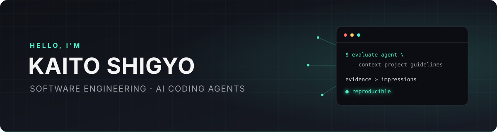

  

  <a href="https://furedea.com">Website</a> ·
  <a href="https://ken.ieice.org/ken/paper/202607247cwN/">Publication</a> ·
  <a href="https://zenn.dev/furedea">Zenn</a> ·
  <a href="https://x.com/furedea596">X</a>

I'm **Kaito Shigyo**, a master's student in the
[POSL Lab](https://posl.ait.kyushu-u.ac.jp/) at Kyushu University. I research
software engineering, with a focus on quantitatively evaluating how development
processes, tasks, and project-specific context affect **AI coding agents**.

## Research focus

- Evaluation of coding agents under project-specific conventions
- Reproducible experiments for agent capabilities and behavior
- Developer tooling for reliable, context-aware agent workflows

## Selected work

- **[FIRE-Bench](https://github.com/furedea/FIRE-Bench)** — Evaluating agents
  on the rediscovery of scientific insights through claim-level analysis
- **[swe-conform](https://github.com/furedea/swe-conform)** — Building reusable
  tasks for evaluating coding agents against project guidelines
- **[agent-harness](https://github.com/furedea/agent-harness)** — Keeping Codex
  and Claude Code agent policies, skills, and safety controls in one portable
  harness
- **[furedea.com](https://github.com/furedea/furedea.com)** — A bilingual
  personal website and publishing workflow built with Astro

## Publication

**Evaluating Coding Agents for Refactoring Under Project-Specific Conventions**

Kaito Shigyo, Masanari Kondo, and Yasutaka Kamei. IEICE Technical Report, 2026.
[Paper](https://ken.ieice.org/ken/paper/202607247cwN/)

## Latest writing

[ぼくのかんがえたさいきょうのターミナル環境 2026][terminal-article]
— a practical tour of a modern, agent-oriented terminal environment.

[terminal-article]: https://furedea.com/ja/blog/modern-terminal-environment/
